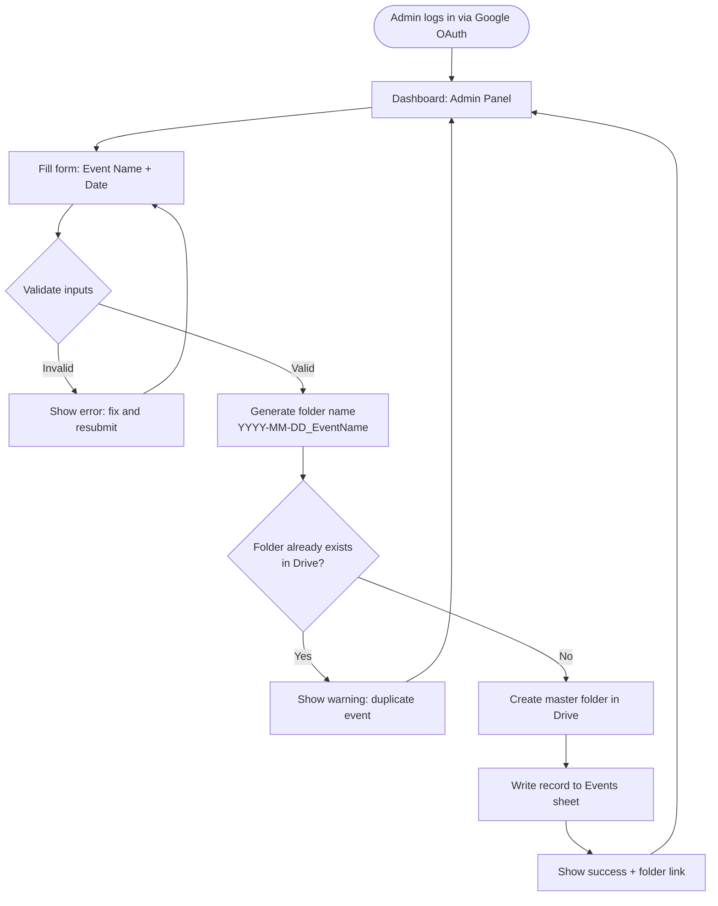
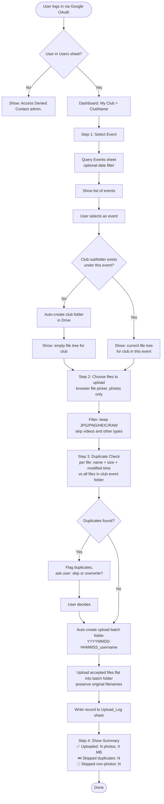
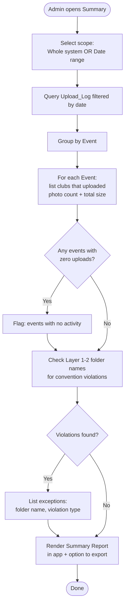
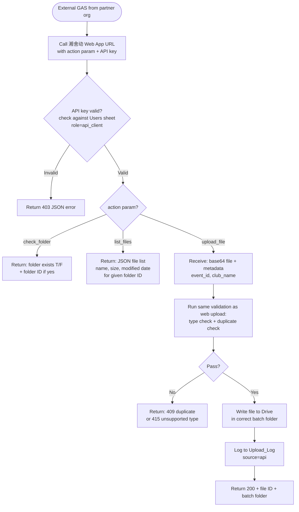

# 湘舍动公益文件系统 — Development Plan
**Version**: 1.0 (GAS) | **Next**: 2.0 (Node.js / Firebase)
**Last Updated**: 2026-03-17

---

## 1. System Overview

A Google-native photo management system for the 湘舍动公益 organization. Running clubs upload race photos into a shared Google Drive via a GAS Web App. Admins manage events and monitor the system. A REST-style API allows authorized external GAS programs (from partner orgs) to interact with the system programmatically.

**Stack (v1)**
- **Frontend + Backend**: Google Apps Script (GAS) Web App (HTML Service)
- **Storage**: Google Drive (湘舍动's account)
- **Database**: Google Sheets (users, events log, upload audit)
- **Auth**: Google OAuth (all users must have Google accounts)
- **Hosting**: GAS Web App deployment (no external server needed)

**Migration Notes for v2 (Node.js / Firebase)**
- All business logic will be extracted into service modules
- Google Drive API calls → same API, just via Firebase backend
- Google Sheets → Firestore
- GAS Web App → Firebase Hosting + Cloud Functions
- Naming conventions and folder structure remain identical

---

## 2. Folder Naming Convention

The system controls the top 3 layers. Below the upload batch folder, files are user-provided and kept as-is (flat copy).

```
📁 [ROOT] 湘舍动公益文件系统
│
├── 📁 YYYY-MM-DD_EventName          ← Layer 1: Master Event Folder (Admin creates)
│   │                                    e.g. 2025-11-03_NYC_Marathon
│   │
│   ├── 📁 ClubName                  ← Layer 2: Running Club Folder (auto-created on first upload)
│   │   │                                e.g. New_Bee | Misty_Mountain | Nankai
│   │   │
│   │   └── 📁 YYYYMMDD-HHMMSS_username   ← Layer 3: Upload Batch Folder (auto-created per upload)
│   │       │                                 e.g. 20251103-093500_cathylin
│   │       │
│   │       ├── photo1.jpg           ← Layer 4+: User files, flat copy, original names preserved
│   │       ├── photo2.jpg
│   │       └── ...
│   │
│   └── 📁 AnotherClub
│       └── ...
│
└── 📁 2025-10-30_Another_Event
    └── ...
```

**Convention Rules (enforced by system)**
| Layer | Pattern | Example | Validated? |
|-------|---------|---------|-----------|
| Master Event | `YYYY-MM-DD_Title_Case_Name` | `2025-11-03_NYC_Marathon` | ✅ Yes |
| Club Folder | Must match approved club name in Sheets | `New_Bee` | ✅ Yes |
| Upload Batch | `YYYYMMDD-HHMMSS_username` | `20251103-093500_cathylin` | ✅ Auto-generated |
| Files | Original filename, photos only | `DSC_0042.jpg` | ⚠️ Type-checked only |

**Exception Alert**: Any folder/file at Layer 1–2 that doesn't match convention triggers an admin notification (email + flagged in audit sheet).

---

## 3. Data Model (Google Sheets)

Three sheets in one Google Sheets file:

### Sheet 1: `Users`
| Column | Type | Description |
|--------|------|-------------|
| email | String | Google account email (primary key) |
| running_club | String | Club name (must match approved list) |
| role | Enum | `admin` or `user` |
| status | Enum | `active` / `inactive` |
| added_date | Date | When the record was created |
| added_by | String | Admin email who created it |

### Sheet 2: `Events`
| Column | Type | Description |
|--------|------|-------------|
| event_id | String | Auto-generated UUID |
| event_name | String | Human-readable name |
| event_date | Date | Race date |
| folder_name | String | `YYYY-MM-DD_EventName` |
| drive_folder_id | String | Google Drive folder ID |
| created_by | String | Admin email |
| created_at | Timestamp | |

### Sheet 3: `Upload_Log`
| Column | Type | Description |
|--------|------|-------------|
| log_id | String | UUID |
| event_id | String | FK → Events |
| club_name | String | |
| uploaded_by | String | User email |
| batch_folder_name | String | `YYYYMMDD-HHMMSS_username` |
| batch_folder_id | String | Drive folder ID |
| file_count | Number | Photos accepted |
| total_size_mb | Number | |
| skipped_duplicates | Number | Files skipped |
| skipped_non_photo | Number | Non-image files ignored |
| upload_timestamp | Timestamp | |
| source | Enum | `web_app` / `api` |

---

## 4. Flowcharts

### 4.1 Admin: Create Event



---

### 4.2 User: Upload Photos Flow



---

### 4.3 Admin: Reconciliation & Summary Report



---

### 4.4 Cross-Org API Flow (External GAS → 湘舍动)



> **GAS REST API Note**: GAS Web Apps support `doGet(e)` and `doPost(e)` as HTTP endpoints. When deployed as *"Execute as: Me"* + *"Access: Anyone with Google Account"*, external callers can authenticate via OAuth 2.0 bearer token using `UrlFetchApp`. For cross-org machine-to-machine calls, we use a shared API key stored in the Users sheet (role: `api_client`) as the v1 auth mechanism. v2 will replace this with proper service account OAuth.

---

## 5. Development Phases

### Phase 1 — Foundation (Week 1–2)
**Goal**: Skeleton GAS Web App running with auth and basic Drive/Sheets wiring.

- [ ] Set up Google Drive root folder structure for 湘舍动
- [ ] Create Google Sheets database (3 sheets as designed)
- [ ] Deploy GAS Web App skeleton with Google OAuth login
- [ ] Role-check middleware: read user from Sheets on login
- [ ] Utility: folder name validator (regex for Layer 1–2)
- [ ] Admin: CRUD for Users sheet (add/edit/deactivate users)

---

### Phase 2 — Event Management (Week 2–3)
**Goal**: Admins can create and browse events.

- [ ] Admin UI: Create Event form (name + date → validated folder creation)
- [ ] Admin UI: List Events (sortable, filterable by date)
- [ ] Drive service: `createMasterFolder(eventDate, eventName)`
- [ ] Drive service: `createClubFolder(eventFolderId, clubName)`
- [ ] Sheets service: write/read Events sheet
- [ ] Exception detection: scan Layer 1–2 on any Drive operation, log violations

---

### Phase 3 — Upload Flow (Week 3–5)
**Goal**: Users can select an event and upload photos end-to-end.

- [x] User UI: Event picker with date range filter
- [x] User UI: Show file tree for club subfolder (read-only view)
- [x] Browser file picker: multi-select, client-side type filter (jpg/png/heic/raw)
- [x] Drive service: `createBatchFolder(clubFolderId, timestamp, username)`
- [x] Duplicate check service: compare filename + size vs existing files in club folder
- [x] Upload service: sequential file-by-file upload to Drive (GAS 50MB limit per file, warn user)
- [x] Sheets service: write Upload_Log on completion
- [x] Summary screen: upload results (counts, skips, sizes)

---

### Phase 4 — Admin Summary & Reconciliation (Week 5–6)
**Goal**: Admins can generate system-wide and event-level reports.

- [x] Admin UI: Summary dashboard with date range picker
- [x] Report: events with uploads (club, count, size)
- [x] Report: events with *no* uploads (attention list)
- [x] Report: Layer 1–2 naming exceptions
- [x] Export: summary as CSV (Google Sheets export)
- [x] Email notification to admin when exceptions are detected

---

### Phase 5 — Cross-Org REST API (Week 6–7)
**Goal**: External GAS programs can check folders, list files, and upload photos via HTTP.

- [x] `doGet(e)` handler: route by `?action=` param
  - `api_check_folder`: given event name → return folder ID or null
  - `api_list_files`: given folder ID → return JSON file list
- [x] `doPost(e)` handler:
  - `api_upload_file`: accept base64 encoded photo + metadata, run full validation pipeline
- [x] API key auth: `?api_key=<registered-email>` (GAS has no header access); Users sheet role=api_client
- [x] Rate limiting: simple counter in Rate_Limit sheet (max 60 requests per hour per key)
- [x] Error response standards: JSON `{status, code, message, data}`
- [x] Write API client example in GAS for partner orgs to copy (`example/partner-client.gs`)

---

## 6. Wishlist (v2 / Future)

| Feature | Notes |
|---------|-------|
| EXIF-based duplicate detection | Requires Drive API + image parsing library; GAS limitation |
| Nested folder copy from external Drive | Complex tree traversal; natural fit for Node.js v2 |
| Video support | Storage + processing costs; design separately |
| Thumbnail preview in file browser | GAS can serve Drive thumbnail URLs |
| Batch download for admins | Google Drive zip export API |
| Webhook notifications | GAS has no native webhooks; use polling or v2 |
| Firestore migration | Replace Sheets for better query performance at scale |

---

## 7. Technical Constraints & Mitigations (GAS v1)

| Constraint | Limit | Mitigation |
|-----------|-------|------------|
| GAS execution timeout | 6 minutes | Chunk uploads client-side, one file at a time |
| GAS URL Fetch payload | 50 MB | Warn user; recommend <20MB per file for API uploads |
| Drive API quota | 1,000 req/100 sec | Batch Drive API calls where possible |
| Sheets read/write speed | Slow for large data | Cache event list in memory per session |
| No background jobs | — | All operations are synchronous and user-triggered in v1 |

---

## 8. Open Questions / Decisions Needed

1. **Club name list**: Should we maintain an approved list of club names in the Sheets (for validation)? Who can add new clubs?
2. **File size limit per upload session**: Set a max total MB per upload batch to avoid timeouts?
3. **API key distribution**: How do partner orgs receive and rotate their API keys?
4. **Photo types**: JPG + PNG + HEIC. Include RAW formats (CR2, ARW, NEF)? These are large.
5. **Data retention**: Are old events ever archived or deleted from Drive?
